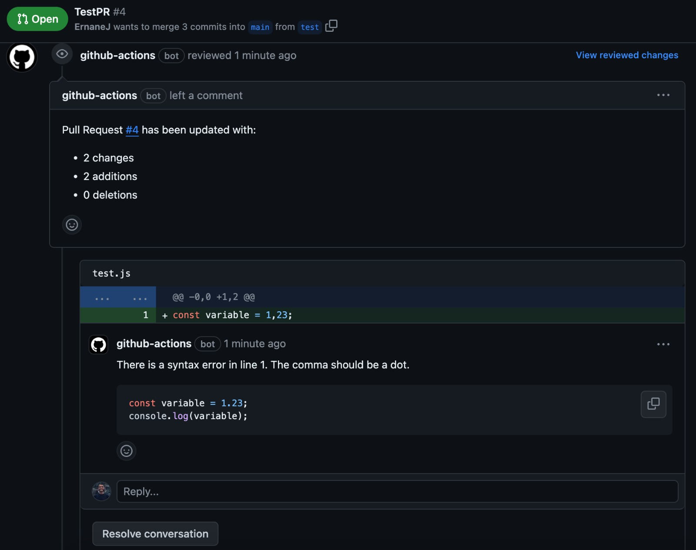

# Code Guardian CI GitHub Action

🤖 **AI-powered Automated Code Reviewer**



See this review comment [here](https://github.com/ErnaneJ/code-guardian-ci/pull/4#pullrequestreview-1795629618).

## Description

Code Guardian CI is an automated code review GitHub Action that leverages the power of ChatGPT to provide insightful feedback on your pull requests. This action uses prompts in ChatGPT to analyze your code changes and offers suggestions to improve code quality.

## Usage

To integrate Code Guardian CI into your workflow, add the following YAML configuration to your GitHub Actions workflow file (e.g., `.github/workflows/code-guardian-ci.yml`):

```yaml
name: Code Guardian CI

on:
  pull_request:
    types:
      - opened
      - synchronize

jobs:
  code-guardian-ci:
    runs-on: ubuntu-latest
    steps:
      - name: Checkout Repository
        uses: actions/checkout@v2

      - name: Run Code Guardian CI
        uses: ErnaneJ/code-guardian-ci-action@v1
        with:
          owner: ${{ github.repository_owner }}
          repo: ${{ github.event.repository.name }}
          pr_number: ${{ github.event.number }}
          token_g: ${{ secrets.GITHUB_TOKEN }}
          token_oia: ${{ secrets.OPENIA_API_TOKEN }}
```

## Inputs

- **owner** (required): The owner of the repository.
- **repo** (required): The name of the repository.
- **pr_number** (required): The number of the pull request.
- **token_g** (required): The token to use to access the GitHub API.
- **token_oia** (required): The token to use to access the OpenIA API.

## Example

```yaml
uses: your-username/code-guardian-ci-action@v1
with:
  owner: 'your-username'
  repo: 'your-repository'
  pr_number: 123
  token_g: ${{ secrets.GITHUB_TOKEN }}
  token_oia: ${{ secrets.OPENIA_API_TOKEN }}
```

## License

This GitHub Action is licensed under the [MIT License](LICENSE). 📜